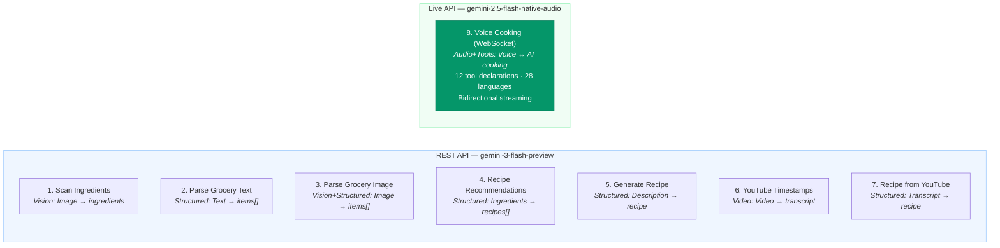
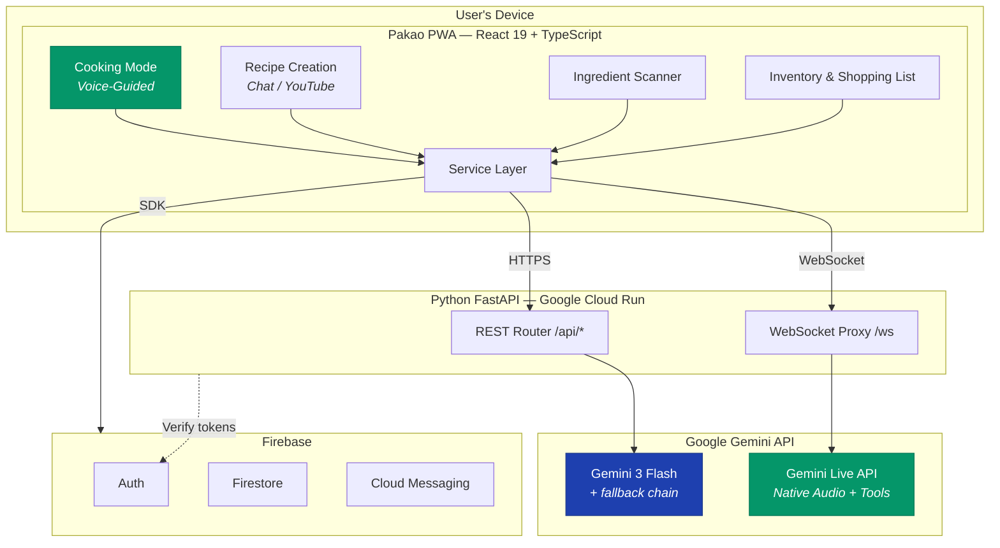
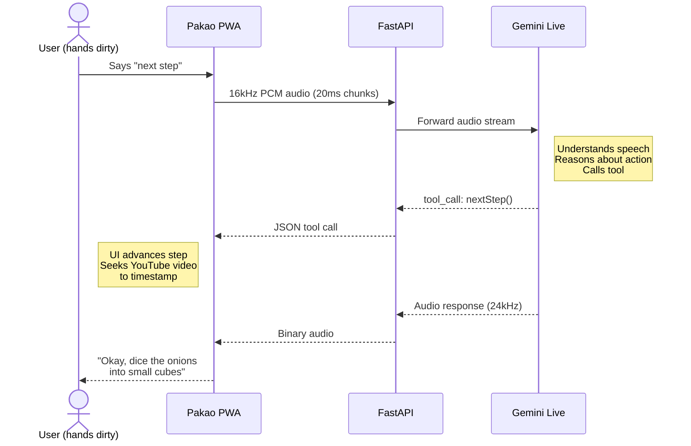

<div align="center">


# Pakao — Hands-Free AI Cooking Assistant

**Your kitchen sous-chef, powered by Gemini.**

Say "next step" with dirty hands. Pakao hears you, speaks back, advances the recipe,<br/>seeks the YouTube video to the right timestamp, and sets a timer — all without touching your phone.

[](#)
[](#)
[](#)

[**Try the Live App**](https://pakao-ai-gemini-3-hackathon.netlify.app) &nbsp;|&nbsp; [Architecture](docs/ARCHITECTURE.md) &nbsp;|&nbsp; [For Judges](docs/JUDGES.md)

</div>

---

## What it does

Pakao turns any cooking video or text description into a **voice-guided cooking session**. You speak, Gemini listens, reasons about what tool to call, and responds with audio — while the UI updates hands-free.

**The core loop:**

> You say "next step" → Gemini Live API understands your speech → decides to call `nextStep()` → UI advances the step counter and seeks the YouTube video to that step's timestamp → Gemini speaks back "Okay, now dice the onions into small cubes" — all in under 2 seconds, fully hands-free.

---

## Features

| Feature | How Gemini Powers It |
|---------|---------------------|
| **Voice cooking mode** | Gemini Live API (WebSocket) — bidirectional audio streaming with 12 tool calls for step navigation, timers, video control, heat level |
| **Create recipe from YouTube** | Gemini processes the actual video file, extracts timestamped transcript, builds a recipe with per-step MM:SS timestamps that sync with the embedded player |
| **Create recipe from text** | "Quick egg breakfast" → Gemini generates full structured recipe (title, ingredients, steps, times, difficulty) respecting dietary constraints |
| **Ingredient scanner** | Point your camera → Gemini Vision identifies items → Gemini recommends 3 recipes you can make right now |
| **Smart inventory** | Add groceries by photo (receipt/pantry), voice, or text — Gemini parses quantities and units intelligently |
| **Recipe setup** | Voice-guided serving scaling before cooking ("scale for 6 people") |
| **Meal reminders** | Push notifications at your preferred times with recipe suggestions based on what's in your pantry |
| **Share recipes** | Shareable links with Open Graph previews for social media |
| **28 voice languages** | Cook in English, Hindi, Spanish, Japanese, and 24 more |
| **Installable PWA** | Add to home screen on any device |

---

## How Gemini Powers Pakao — 8 Integration Points



**Gemini capabilities used:** Text generation, structured output (JSON schemas), vision (images), video understanding (FileData), real-time audio streaming, tool/function calling, multi-language speech.

---

## Architecture



**[Full architecture with all diagrams →](docs/ARCHITECTURE.md)**

---

## Voice Cooking Mode — How It Works



The voice assistant has **12 tools** it can call: `nextStep`, `previousStep`, `goToStep`, `startTimer`, `pauseTimer`, `resumeTimer`, `stopTimer`, `setTemperature`, `setAudioSource`, `setVideoPlayback`, `setVideoMute`, `finishRecipe`.

---

## Model Strategy

| Use Case | Model | Why |
|----------|-------|-----|
| REST endpoints (7) | `gemini-3-flash-preview` | Latest, fastest for structured output |
| Voice cooking | `gemini-2.5-flash-native-audio-preview` | Native audio I/O + tool calling |
| Fallback chain | 3-flash → 2.5-flash → 2.0-flash → 1.5-flash | Graceful degradation if primary unavailable |

Rate limits (429) are **never retried** with fallback models — returned immediately to the client.

---

## Tech Stack

| Layer | Technology |
|-------|-----------|
| **Frontend** | React 19 · TypeScript · Vite · Tailwind CSS |
| **Backend** | Python FastAPI · Uvicorn · google-genai SDK |
| **AI** | Gemini 3 Flash (REST) · Gemini Live API (WebSocket) |
| **Data** | Firebase Auth · Firestore · Storage · Cloud Messaging |
| **Audio** | Web Audio API · AudioWorklet · 16kHz/24kHz PCM |
| **Hosting** | Netlify (CDN + cron) · Google Cloud Run (zero cold starts) |
| **PWA** | Workbox · Service Workers |

---

## Quick Start

<details>
<summary><b>Run locally (for judges and contributors)</b></summary>

**Prerequisites:** Node.js 18+, Python 3.10+

```bash
# 1. Install everything
npm install
cd server && pip install -r requirements.txt && cd ..

# 2. Configure environment
# Frontend: .env.local (Firebase config — already included for demo)
# Backend: server/.env with GEMINI_API_KEY and FIREBASE_PROJECT_ID

# 3. Run both frontend + backend
npm run run
```

App opens at **https://localhost:5173** (accept the self-signed cert).

See [docs/JUDGES.md](docs/JUDGES.md) for detailed setup and demo walkthrough.

</details>

<details>
<summary><b>Environment variables</b></summary>

**Frontend** (`.env.local`):
- `VITE_FIREBASE_API_KEY`, `VITE_FIREBASE_AUTH_DOMAIN`, `VITE_FIREBASE_PROJECT_ID`
- `VITE_FIREBASE_STORAGE_BUCKET`, `VITE_FIREBASE_MESSAGING_SENDER_ID`, `VITE_FIREBASE_APP_ID`
- `VITE_FIREBASE_VAPID_KEY` (for push notifications)

**Backend** (`server/.env`):
- `GEMINI_API_KEY` — Google Gemini API key
- `FIREBASE_PROJECT_ID` — Firebase project ID
- `server/serviceAccountKey.json` — Firebase service account (for guest tokens + share preview)

</details>

<details>
<summary><b>Deployment</b></summary>

- **Frontend:** Deploys to Netlify (`netlify.toml` included). CDN-served PWA.
- **Backend:** Deploys to Google Cloud Run with `min-instances: 1` for zero cold starts. See `server/DEPLOY_CLOUD_RUN.md`.
- **Netlify** proxies `/api/*`, `/ws`, `/share/*` to Cloud Run automatically.

</details>

---

## Project Structure

```
pakao/
├── components/          # React UI (CookingMode, RecipeSetup, Scanner, Inventory, ...)
├── services/            # API clients (geminiService, youtubeRecipeService, dbService, ...)
├── server/              # Python FastAPI backend
│   ├── gemini_api.py    # 7 REST endpoints → Gemini 3 Flash
│   ├── gemini_live.py   # WebSocket proxy → Gemini Live API
│   ├── meal_reminder.py # Push notification scheduler
│   ├── share_preview.py # OG meta tags for social sharing
│   └── auth.py          # Firebase token verification
├── types.ts             # TypeScript interfaces
├── App.tsx              # Main app shell + routing
└── docs/
    ├── ARCHITECTURE.md  # Full system architecture (Mermaid diagrams)
    ├── JUDGES.md        # Quick-start guide for evaluators
    └── HACKATHON_AUDIT.md
```
