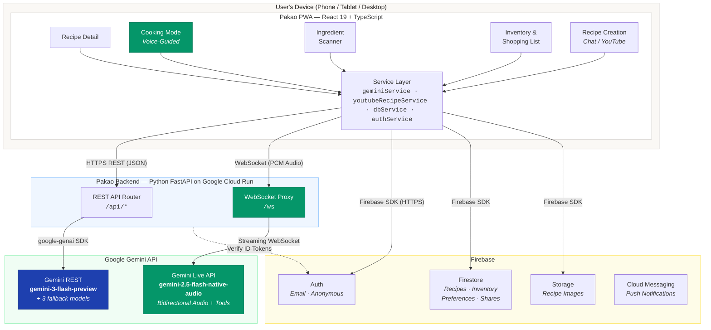
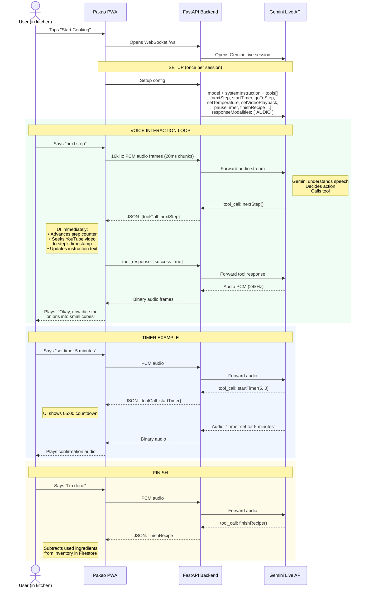
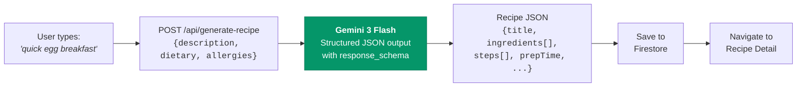
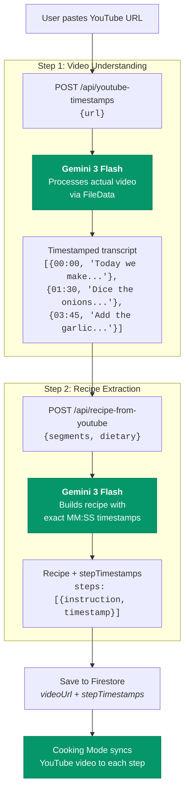
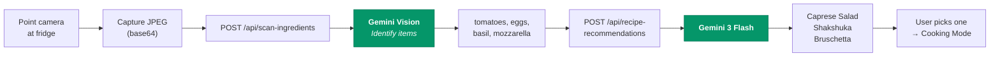
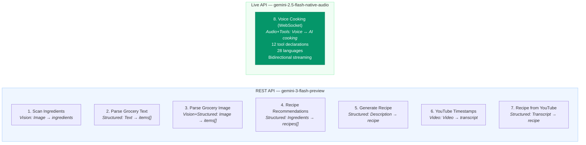
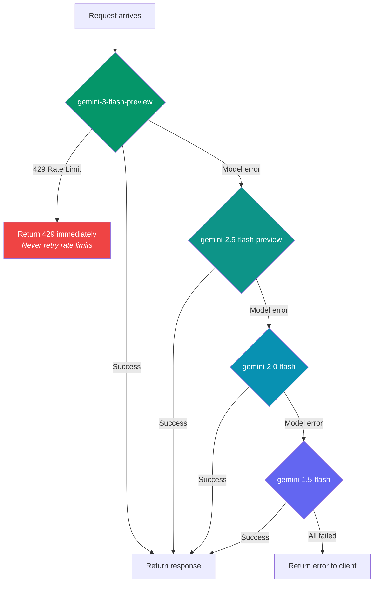
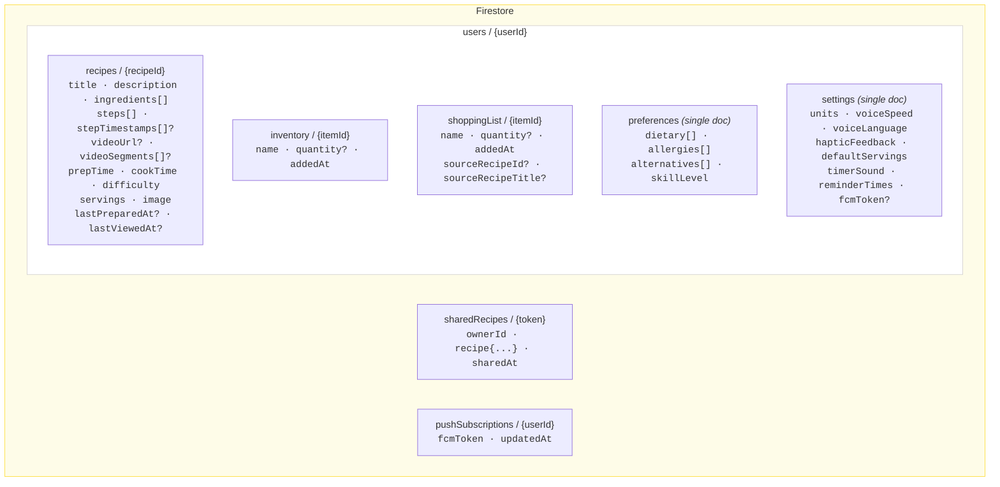
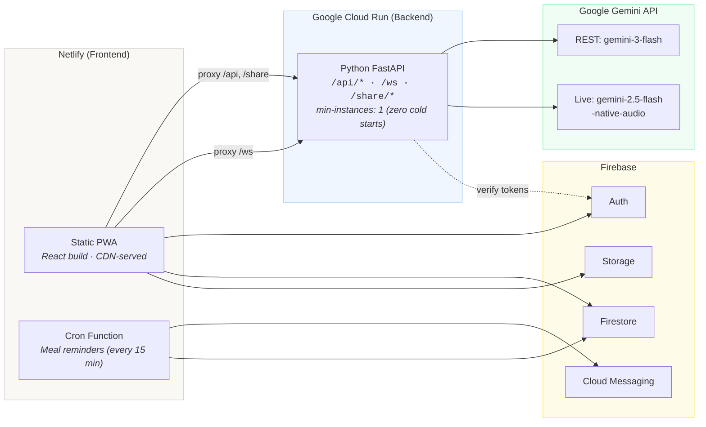
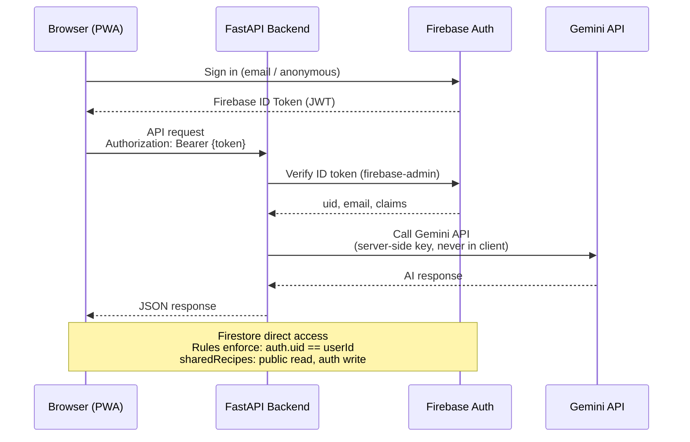

# Pakao — System Architecture

## High-Level Overview

---

## Voice Cooking Mode — The Core Feature

This is what makes Pakao unique: fully hands-free cooking powered by Gemini Live API.

---

## Recipe Creation Flows

### Flow A: Create from Text Description

### Flow B: Create from YouTube Video (2-step)

### Flow C: Ingredient Scanner

---

## All 8 Gemini Integration Points

---

## Model Fallback Strategy

---

## Data Model (Firestore)

---

## Deployment Architecture

---

## Security Model

---

## Tech Stack Summary

| Layer | Technology | Role |
|-------|-----------|------|
| **Frontend** | React 19 · TypeScript · Vite | PWA UI |
| **Styling** | Tailwind CSS | Responsive design |
| **Backend** | Python FastAPI · Uvicorn | API + WebSocket proxy |
| **AI (REST)** | Gemini 3 Flash (google-genai SDK) | Recipe gen, vision, video |
| **AI (Voice)** | Gemini Live API (WebSocket) | Real-time audio + tool calling |
| **Auth** | Firebase Auth | Email + anonymous sign-in |
| **Database** | Firebase Firestore | Recipes, inventory, settings |
| **Storage** | Firebase Storage | Recipe images |
| **Push** | Firebase Cloud Messaging | Meal reminders |
| **Frontend Host** | Netlify (CDN) | Static PWA + cron functions |
| **Backend Host** | Google Cloud Run | Zero cold-start API |
| **Audio** | Web Audio API + AudioWorklet | Mic capture + playback |
